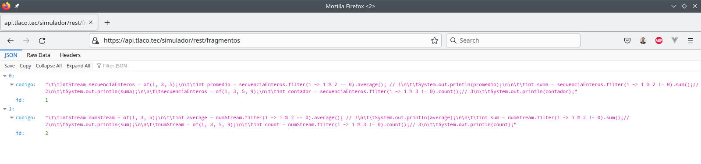
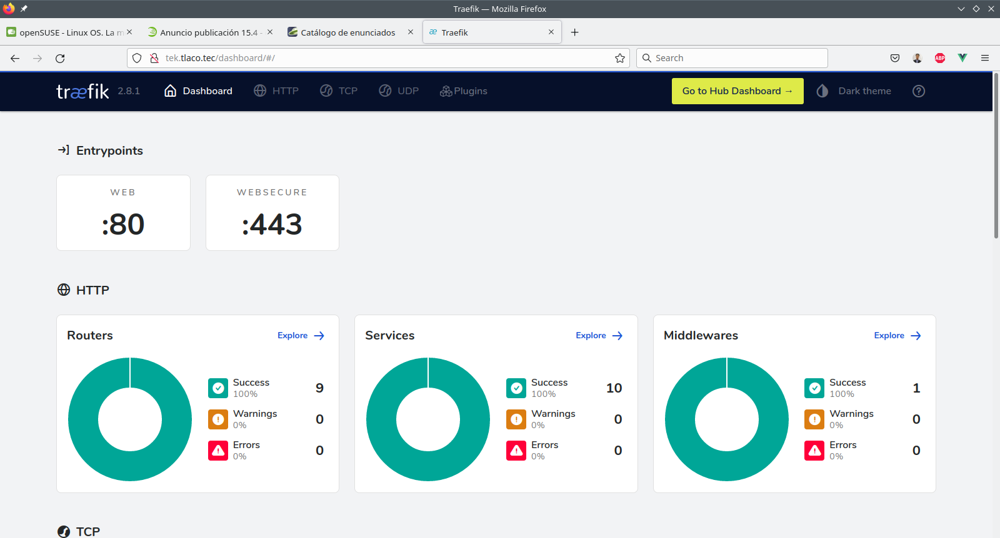
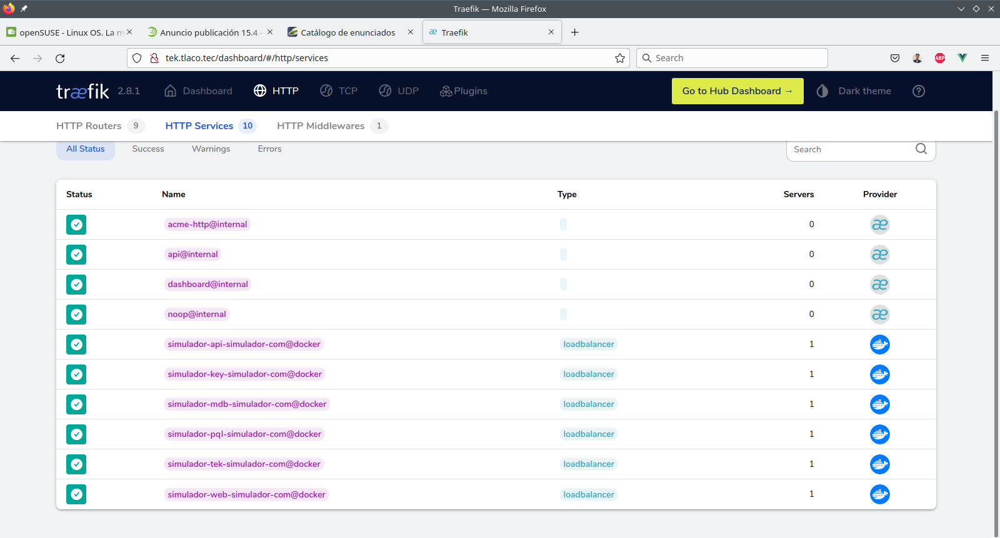

# Objetivos, consideraciones y expectativas

* El objetivo principal de la aplicación *es apoyar al aspirante a prepararse de forma efectiva para presentar y acceder a una certificación de Oracle a nivel profesional*. Por tal motivo es indispensable posea una base sólida de conocimientos en las tecnologías para el desarrollo de software.

* Se debe tener en cuenta que dicha aplicación está desarrollada con base en estándares internacionales de código abierto.

* Al tratarse de una aplicación web empresarial está integra por una serie de módulos pertenecientes al proyecto que lleva su nombre.

* Oficialmente sólo estará disponible en español, enfocada principalmente para aspirantes hispanohablantes, sin embargo, queda abierta la posibilidad de incluir otros idiomas de manera extra oficial.

# Requerimientos

Un equipo de cómputo que soporte de manera adecuada el siguiente listado de software:

- openjdk 11.0.16 o superior
- git version 2.35.3 o superior
- docker 20.10.17-ce o superior
- docker-compose version 1.25.1 o superior

Si además se planea implementar alguna mejora o usar alguno de sus módulos en futuros desarrollos, se recomienda usar un equipo de cómputo más potente.

# Despliegue del _Simulador_

Como se ha comentado con anterioridad, la aplicación fué diseñada y desarrollada bajo un esquema distribuido, planeada para maximizar el aprendizaje en todo momento.

## Configurar el equipo para emular un VPS

Si bien estríctamente la apliación debería desplegarse de manera distribuida, en esta ocasión se considera mejor desplegarla de forma local para consolidar y reforzar algunos conocimientos que son vitales en el desarrollo de las apliaciones web empresariales.

En caso de contar con un servidor virtual privado (también conocido como Virtual Private Server o VPS por sus siglas en inglés), es preferible usarlo en lugar de equipo de cómputo.

La configuración es muy simple y sólo se necesita editar el archivo ***hosts*** agregado los siguientes DNS:

```bash
# IP Local    Hostname
127.0.0.1     mdb.tlaco.tec
127.0.0.1     pql.tlaco.tec
127.0.0.1     key.tlaco.tec
127.0.0.1     tek.tlaco.tec
127.0.0.1     api.tlaco.tec
127.0.0.1     web.tlaco.tec
```
## Descargar el proyecto principal

Se procede a descargar o clonar para ser más específico el reposotirio desde github, se recomienda crear un directorio único para este proyecto de manera global, dicho directorio será referenciado de ahora en adelante como `$DIRECTORIO_DE_TRABAJO` y se procede a ejecutar los siguientes comandos:

```bash
  user@host:~$ cd $DIRECTORIO_DE_TRABAJO
  user@host:~$ mkdir simulador-com
  user@host:~$ cd simulador-com
  user@host:~$ git clone https://github.com/oobravom/simulador-com.git
  user@host:~$ 
```

## Levantar los servicios y desplegar las apliaciones web principales

Una vez que se ha obtenido el proyecto, se procede con la ejecución de los siguientes comandos, revisando que en todo momento el éxito de los mismos y en caso contrario revise detalladamente los pasos anteriores.

Debido a que en la primera ejecución, se descargarán todas las dependencias necesarias, además de la creación e inicialización de los servicios, el despliegue demorará unos minutos, sea paciente.

```bash
  user@host:~$ cd $DIRECTORIO_DE_TRABAJO/simulador-com/
  user@host:~$ docker-compose up -d
  user@host:~$ docker-compose logs -f
  user@host:~$ 
```

Por lo general el servicio asociado a la apliación web es el último en desplegase, por lo tanto observará en el log de salida algo similar a lo siguiente:

```
...
...
web.tlaco.tec    | [AUDIT   ] CWWKZ0001I: Application simulador-web started in 18.393 seconds.
mdb.tlaco.tec    | 
web.tlaco.tec    | [AUDIT   ] CWWKF0012I: The server installed the following features: [appAuthentication-2.0, appAuthorization-2.0, appClientSupport-2.0, appSecurity-4.0, batch-2.0, beanValidation-3.0, cdi-3.0, concurrent-2.0, connectors-2.0, connectorsInboundSecurity-2.0, distributedMap-1.0, enterpriseBeans-4.0, enterpriseBeansHome-4.0, enterpriseBeansLite-4.0, enterpriseBeansPersistentTimer-4.0, enterpriseBeansRemote-4.0, expressionLanguage-4.0, faces-3.0, jakartaee-9.1, jdbc-4.2, jndi-1.0, json-1.0, jsonb-2.0, jsonp-2.0, jwt-1.0, localConnector-1.0, mail-2.0, managedBeans-2.0, mdb-4.0, messaging-3.0, messagingClient-3.0, messagingSecurity-3.0, messagingServer-3.0, microProfile-5.0, monitor-1.0, mpConfig-3.0, mpFaultTolerance-4.0, mpHealth-4.0, mpJwt-2.0, mpMetrics-4.0, mpOpenAPI-3.0, mpOpenTracing-3.0, mpRestClient-3.0, pages-3.0, persistence-3.0, persistenceContainer-3.0, restConnector-2.0, restfulWS-3.0, restfulWSClient-3.0, servlet-5.0, ssl-1.0, transportSecurity-1.0, webProfile-9.1, websocket-2.0, xmlBinding-3.0, xmlWS-3.0].
mdb.tlaco.tec    | 2022-08-08 06:57:53+00:00 [Note] [Entrypoint]: MariaDB init process done. Ready for start up.
web.tlaco.tec    | [AUDIT   ] CWWKF0011I: The defaultServer server is ready to run a smarter planet. The defaultServer server started in 43.523 seconds.
...
...
```
## Verificar la interface principal de los servicios RESTful (opcional)

Ir a la siguiente dirección https://api.tlaco.tec/simulador/rest/fragmentos y validar que el servicio nos regrese el catálogo de fragmentos de código disponibles.



## Verificar los servicios en el dashboard (opcional)

Como toda aplicación distribuida esta cuenta con un proxy inverso y balanceador de cargar proprcionando por https://traefik.io/traefik/ para más información se recomienda visitar la página oficial.

Se procede a ingresar al dashboard y navegar por el mismo revisando es estatus de los servicios, siguiendo estos pasos:

  - Ir a la siguiente dirección: http://tek.tlaco.tec/dashboard/
  - Autentificarse con las siguientes credenciales:
  - Username: simulador-tek
  - Password: TlacoTec
  
  

  - Navege por la sección de servicios, puede ingresa en cualquiera de ellos para mayor detalle del mismo.
  
  


# Configuración Inicial del _Simulador_

Si bien la mayor parte de la configuración principal de los servicios y módulos del aplicativo se hacen de forma automática mediante los contenedores, existen ciertas configuraciones que se deben llevar a cabo de forma manual como se muestra en los próximos apartados.

## Inicializar los perfiles de seguridad en keycloak

- Ir a la siguiente dirección: https://key.tlaco.tec/admin/
- Autentificarse con las siguientes credenciales:
  - Username: simulador-key
  - Password: TlacoTec


### Agregar el usuario inicial: *oobravom*

1. Seleccionar el realm adecuado en este caso **_Simulador-key_**

   

   

   ***NOTA: En caso de haber agregado el usuario con anterioridad ir a la sección [Configurar el usuario inicial](#id-config-usr).***

2. Ir a la seccion _Manage -> Users_, clic en **_Create new user_**:

   

3. Ingresar la información requerida, clic en **_Create_**:

   ***NOTA: Es muy importante capturar en campo de Username el valor de "oobravom" como se muestra en la siguiente imagen.***

   

### Configurar el usuario inicial: *oobravom*

1. Ir a la pestaña _Credentials_, clic en **_Set password_**:
   
   
   
2. Ingresar la información solicitada:
   - Usar **tlacotepec** para _Password/Password Confirmation_, clic en **_Save_**:
   
   
   
   - Clic en **_Save password_**:
   
   

3. Ir a la pestaña _Role Mapping_, clic en **_Assing role_**:
    
   
   
   - Seleccionar sus roles necesarios (sólo requerimos **administrador**), clic en **_Assing_**:
   
   
   
   - Verificar que se hayan asignado los roles correctamente:
   
   

4. Ir a la pestaña _Groups_, clic en **_Join Group_**:

   

   - Asignar sus grupos necesarios (sólo requerimos **usuarios-simulador**), clic en **_Join_**:
   
   

   - Verificar que se hayan asignado los grupos correctamente:
   
   
   
6. Ir a la pestaña _Details_:

   

   - Verificar que en campo _Required User Actions_ esté vacío:
   
   
   
   - En caso de tener acciones, se deben eliminar, clic en **_Save_**:
   
   
   
## Verificar la generación de las credenciales para el _Simulador_ (opcional)

Usando un cliente HTTP como es _Postman_, solicitar una petición **POST** con las siguientes características:

  - URL: https://key.tlaco.tec/realms/simulador-key/protocol/openid-connect/token
  - realm: simulador-key
  - grant_type: password
  - client_id: simulador-web
  - username: oobravom
  - password: tlacotepec


## Validar que el token devuelto sea adecuado (opcional)

Ir a la siguiente dirección https://jwt.io/ e inspeccionar el *access token* devuelto en la solicitud anterior, 
se recomienda revisar principalmente el **PAYLOAD** verficando los valores configurados en secciones anteriores:


# Probar el _Simulador_

***NOTA: Es muy importante asegurarse se encuentren levantados los servicios de manera correcta.***

Ir a la siguiente dirección: https://web.tlaco.tec/simulador/login.jsf

- Autentificarse con las siguientes credenciales:
  - Usuario: oobravom
  - Contraseña: tlacotepec
  
  

- Verificar que se cargue el catálogo de **enunciados** y se pueda manipular adecuadamente.

  

# Detener el _Simulador_

***NOTA: Se recomienda dar de baja los servicios asociados a simulador sobretodo si la apliación web dejó de ser utilizada.***

```bash
  user@host:~$ cd $DIRECTORIO_DE_TRABAJO/simulador-com/
  user@host:~$ docker-compose stop
  user@host:~$ docker-compose logs -f
  user@host:~$ 
```

# ¡Feliz certificación! ^_^

* Este proyecto es propiedad la organización ***TlacoTec*** quien desea sea de su agrado y/o utilidad. 

* Para cualquier duda, comentado o sugerencia favor de ponerse en contaco con alguno de sus asociados

## ¡Fantásticos desarrollos les desea!


